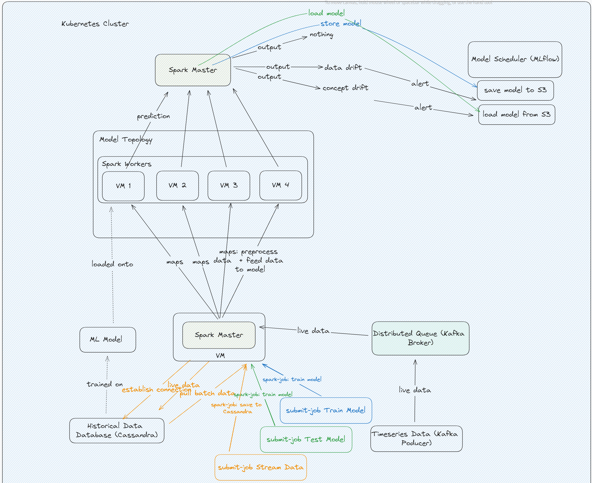
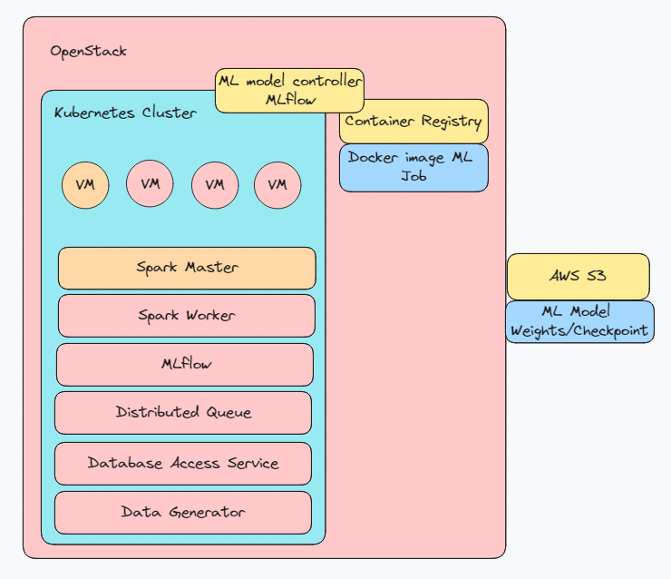
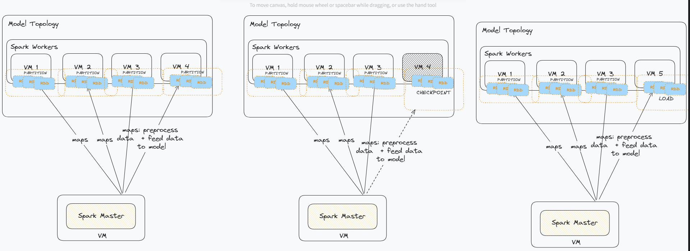
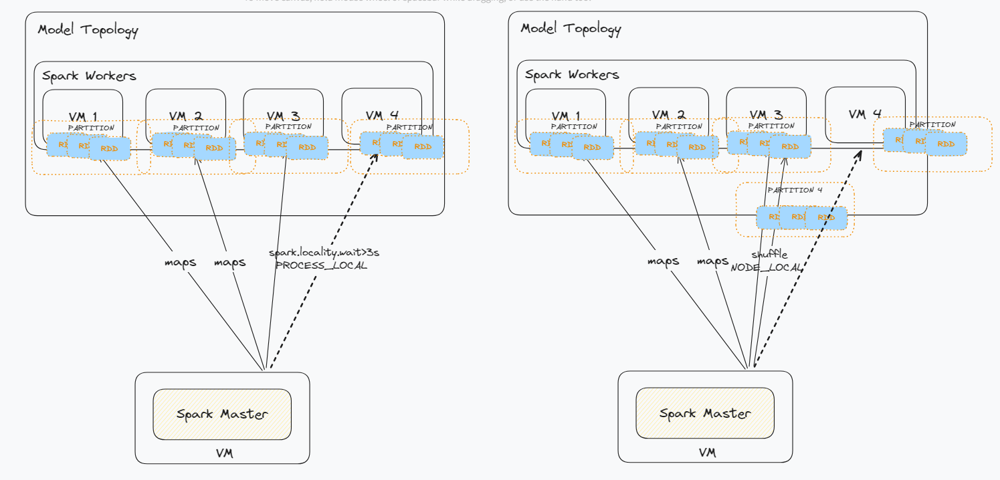

# ECiDA: Data and Concept Drift Detection

## Introduction 
In the dynamic field of machine learning, even the most exceptional models encounter hidden risks known as data and concept drift. Data drift refers to a change in the statistical properties of data, rendering predictions outdated. Concept drift indicates a fundamental shift over time in the relationship between the input and the target.

This project is in collaboration with the ECiDA platform (Evolutionary Changes in Data Analysis). Our main aim is to uncover the aforementioned risks by using a distributed monitoring solution. We focus on data drift detection. After training a machine learning model using historical data, we then continuously analyze data streams to detect statistical deviations. This proactive approach enables timely responses, such as retraining models and adjusting data pipelines, ensuring that machine learning models remain accurate and effective in a constantly evolving world.

## Implementation
### Architecture
A diagram of the project's architecture can be found within the repository in the form of a PDF. It can be accessed [here]("architecture/Scalable Computing Project Architecture.pdf").

We chose to use a real-world dataset, as described in (Street and Kim, 2001). The dataset can be found [here](https://www.win.tue.nl/~mpechen/data/DriftSets/).

The project is a scalable implementation of a drift-detection machine learning algorithm.




#### Apache Kafka
The data generator consists of a data producer, which is implemented with Apache Kafka and which feeds the live data stream into a Kafka Queue. The queue persists the data in case the consumer end is not able to receive it, and it also makes sure that the data points are sent in the order that they were produced. The Kafka broker manages how the data is distributed from the producers to the consumers based on kafka topics, where the producers publish data on a certain topic and the consumers subscribe to a topic from which they receive data. Kafka can also be distributed, where multiple producers publish streams of data to topics, the data streams are stored in multiple distributed queues with data supporting replication and streaming the data to multiple consumers. 

#### Apache Spark

The Kafka consumer is on the Spark service. Spark is a distributed engine for parallelized, fault-tolerance and resilient data processing. It is capable of:
1. Distributed Computing: The data is processed in parallel by multiple nodes
2. Horizontal Scalability: The Spark manager is able to coordinate and scale up and down the nodes which are using the hardware resources
3. In-Memory Computing: The data is partitioned into Resilient Distributed Datasets (RDDs) which reside in-memory while it is processed, avoiding the costly computation of storing the data on disk. The RDDs are immutable and fault-tolerant
4. Data Lineage: New workers are updated with information about the DAGs applied on the RDDs of the parent worker, and therefore do not need to restart the application from the point of data partitioning and task distribution
5. Load Balancing: The Spark scheduler can distribute hardware resources to tasks based on the tasks' computational costs

Spark executes 3 different applications:
1. Streaming data received from Kafka by first processing and storing it into a Dataframe and then streaming the processed data to the Cassandra database
2. Training a ML model with the historical data received from Cassandra and storing the trained model on a S3 bucket in AWS
3. Loading the trained ML model from the S3 bucket and testing the model on the coming data stream from Kafka, and producing an alert when a drift is detected

##### MLSpark

MLSpark is a native library in Apache Spark which is used for performing Machine Learning applications by using the native Dataframe (RDD abstractions) for working with the data. 

Our ML model from this library is a GBTClassifier, which is a Gradient-Boosted Decision Trees algorithm for classification. The model predicts the class labels for each data point and then compares them with the true class labels, respectively. We designed the drift detection based on a threshold approach, where we check if the difference between the Area Under the Curve (AUC) of the test data and the train data is above a threshold value and trigger an alert for potential drift.

#### Cassandra Database

Cassandra is a distributed database which is designed to perform well on timeseries data. Cassandra is designed to partition data on distributed nodes of Cassandra in a ring quorum. The timestamp clustering key in Cassandra can be used to order data within a partition since te timestamp is chronological and already ordered. 

Cassandra stores three different tables which are used for both persisting data for fault-tolerence and also for communicating with Grafana to display columns from the tables in Grafana dashboards. Two tables are populated by applications in Spark: dataframe_test and drift_analysis. One table, dataframe_train, is populated by a job in the Kubernetes cluster which triggers whe the Cassandra service is up and running.

The tables have the following configuration:


```cassandraql
        CREATE TABLE IF NOT EXISTS spark_streams.dataframe_train (
            id UUID,
            timestamp TIMESTAMP,
            feature_0 FLOAT,
            feature_1 FLOAT,
            feature_2 FLOAT,
            label FLOAT,
            PRIMARY KEY ((id), timestamp)
        ) WITH CLUSTERING ORDER BY (timestamp DESC);
```
The dataframe_train table is comprised by an `id` column which is an ascending unique number for each entry, `timestamp` column for keeping track when the data point was producer by Kafka, `feature_0`,`feature_1`,`feature_2` are the processed features from the drift dataset, and `label` is the target value from the drift dataset. The table is ordered from the latest data point to the first data point received from Kafka. Since Cassandra queries the location of the data it wants to retrieve by going through each node consecutively in the quorum ring, we want to have the latest data in the closest node in the ring so that the query will not go through all the nodes in the ring until it finds the latest data it needs to train on.

```cassandraql
        CREATE TABLE IF NOT EXISTS spark_streams.dataframe_test (
            id UUID,
            timestamp TIMESTAMP,
            feature_0 FLOAT,
            feature_1 FLOAT,
            feature_2 FLOAT,
            label FLOAT,
            PRIMARY KEY ((id), timestamp)
        ) WITH CLUSTERING ORDER BY (timestamp DESC);


```
The dataframe_test is a simplified version of the dataframe_train, since we need to store and query fewer columns for the test results.

```cassandraql
    
        CREATE TABLE IF NOT EXISTS spark_streams.drift_analysis (
            id UUID,
            label FLOAT,
            prediction FLOAT,
            feature_0 FLOAT,
            feature_1 FLOAT,
            feature_2 FLOAT,
            timestamp TIMESTAMP,
            train_auc FLOAT,
            test_auc FLOAT,
            drift BOOLEAN,
            PRIMARY KEY ((id), timestamp)
        ); 
```

The drift_analysis table contains a `prediction` column in addition, as well as the values for the Area Under the Curve (AUC), and a boolean value indicating whether a drift was detected or not.

#### Grafana

Grafana is connected to Cassandra with which it can communicate by cassandra query language in order to query data and display it in custom-made dashboards. Grafana functions as our UI for displaying the data collected from our Ml jobs.

HERE ADD TECHNOLOGIES AND THEIR VERISONS:


### Infrastructure

[comment]: <> (Managed to have our components aka Spark, Kafka, Cassandra and Data Generator up via docker compose and successfully able to update Cassandra with our dataset values via a Spark job)




The services described above are deployed in a Kubernetes cluster with the Cluster Orchestrator K3S, which is automatically setup and deployed in our Terraform configuration. Terraform is a declarative way for automatically setting up the infrastructure on our Cloud provider, OpenStack. In addition, we also use an S3 bucket on Amazon Web Services with which Mlflow communicates for storage purposes. On OpenStack reside, after being defined in Terraform, virtual machines on which the Kubernetes cluster is deployed. Inside the Kubernetes cluster one VM is configured as the Spark Master in the Spark Cluster and the other ones are configured as Spark Workers, which will register with the Spark Master and bind to it inside the Spark cluster. The other services: Mlflow, Kafka, Cassandra, Grafana are also deployed in the Kubernetes cluster and distributed across the VMs. For configuring all these services, we mostly use custom Docker images on which we pre-configure the dependencies and the environments. The Docker images are also used in our Docker-compose deployment which deploys all the containers and manages their environments, connections, networking, and replication. The Docker images are kept on the Cloud, in DockerHub.

### UI, Historical & Streaming Data
General:<br>
Our data corresponds to classification problems. There are three attributes (floating point) and one boolean target value. The initial datasets, included 7500 data points in total. We used 1000 of those data points to train our Machine Learning model (historical), with the remaining data serving as streaming data.

Historical data from Cassandra:<br>
These 1000 historical data points are stored into the Cassandra database (table ```spark_streams.dataframe_train```), along with a unique ID (UUID) and timestamp.

Stream data from Kafka to Spark, and from Spark to Cassandra:<br>
Regarding the data streaming pipeline, we transfer data from Kafka to Spark and then from Spark to Cassandra. The process begins by establishing a Spark connection and configuring it to read data from a Kafka topic. The Kafka data is then ingested into Spark as a streaming DataFrame and then written into the Cassandra table (```spark_streams.dataframe_test```).

Grafana Dashboards for UI:<br>
For illustration purposes in Grafana (table ```spark_streams.drift_analysis```), we also use a third table where we store the AUC values and a boolean which corresponds to whether a drift was identified or not.

Spark UI for Spark Application overview:<br>
hardware resources consumed, data partitioning and shuffling, application status, worker scalability


### Core Algorithm & Data location awareness


Dataset: Synthetic data for data and concept drift. The dataset was chosen because it was previously used in studies on drift detection, and therefore can make our project's results comparable to a baseline. The dataset also covers both data and concept drift.
Spark RDD vs Dataframe - we use Dataframes: RDDs are immutable and distributed collections of data stored on the spark workers. Dataframes are higher-level abstractions of RDDs which are organized into tables of columns. The MLSpark library also defaults to using Dataframes.
Fault-tolerance: When a worker node fails, the DAGs (transformations of data) applied on the local RDDs of the worker are saved so that they can be recomputed when the new worker spawns and resumes the DAG tasks of the previous worker.

Data Locality Awareness: The key-value RDDs have their keys hashed so that the Spark context is aware of the location of each RDD after the partitioning of the data into RDDs and the distribution of the RDDs to the different workers. Data locality has different levels in Spark, which is configurable, but we kept the default level. The different levels of data locality in Spark are:
1. NO_PREF: no locality preference; it starts from PROCESS_LOCAL and changes to higher levels by necessity
2. PROCESS_LOCAL: process RDDs from the same JVM
3. NODE_LOCAL: process RDDs from the same spark node, possibly from different executors from the same node. Adds network latency because data needs to travel
4. RACK_LOCAL: process RDDs from the same rack, but different servers.
5. ANY: process RDDs from another network altogether

In out case, setting the data locality to NO_PREF means that Spark will schedule to process on the same executor the data stream stored in the Dataframes on Spark and going out to Cassandra. Since we use the setting `spark.locality.wait(default value is 3s)`, the Spark manager will wait 3 seconds of unresponsiveness from the worker (if the worker is stuck in one data transformation and delays the next data point incoming) until it will redirect the load of the RDDs partition to another executor on the same node (PROCESS_LOCAL). If the whole worker node runs out of hardware resources, then the RDDs will be redirected to another worker node (NODE_LOCAL). 

Data locality awareness can be observed in the Spark UI, which displays the applications submitted on Spark and the allocated resources for running the application (executors and number of cores, which run in parallel), in addition to displaying the read and write operations and the shuffling of RDDs. Less shuffling in the read-write operations are a sign that the data locality level is set in such a way that the jobs can run on the designated executors without an overhead of moving RDDs between executors.


Data Partitioning: The RDDs are built based on a partition schema for the data. Since we are using a Dataframe, the partitioning schema is based on a column of the table. We chose te column 'label', which takes binary values 0 and 1, as the partitioning schema column, because this will enforce a minimum of two RDDs for the data, scalable to subsets of RDD(0) and RDD(1) if the Spark manager redistributes the workload to other executors. The column 'label' was chosen because the other columns have unique values, which would lead to many inefficient RDD partitions. How this will work in our ML setup jobs is:
- One executor will get the data with the RDDs formed out of  the rows in Cassandra with the 'label' value 0, and the other executor will get the partitioning with the 'label' value 1.
- The workers calculate the gradients based on their specific RDD partition, and then return the calculated gradient at the end of each parallel epoch to the master.
- The model on the master node will be updated in parallel by each worker's gradient, by data containing both label = 1 and label = 0.

Data Replication: Our Spark setup does not need data replication on Spark, because Spark already has Fault-tolerance and the data can be restored in case of node failure. In addition, we store the data in the Cassandra database to persist the data outside Spark as well.


### Scalability & Fault tolerance
In this section, we provide answers to the following questions: 
- What will happen if one of the nodes goes down? 
Spark handles horizontal scalability for the worker nodes on each VM. If a worker goes down, then Spark is able to repurpose the worker's resources to a newly spawned worker and also initialize the worker with the DAGs of the previous worker, which makes Spark fault-tolerant. If a VM goes down in OpenStack, then the state can be recuperated by reapplying the Terraform manifests. The still running VMs will not be reconfigured and they will keep their data, but the old VM's data will not be restored outside the Spark Cluster.

- What is happening on the level of data distribution? 
Data is partitioned into RDDs by Spark and shuffled to different Spark workers. The data is distributed and processed in parallel by multiple workers. Since data is stored in RDD, which are immutable and in-memory while processed, the distribution of the data is also fault-tolerant.

- What are the limits of your implementation and how can those be addressed? (CPU, RAM, I/O etc.)
One limit is the hardware, which is restricted to 5 VMs and 8 cores on OpenStack. Therefore, even though we allocate those cores (1 core per executor in Spark) to the VMs, Spark will be able to scale up until all the given hardware resources are exhausted, after which the application running on Spark and overly soliciting it will fail alongside the worker VMs.


## Results
In this section, we present the results of the ML algorithm, which identifies the data drifts.

id                                   | timestamp                       | drift | feature_0 | feature_1 | feature_2 | label | prediction | test_auc | train_auc                 --------------------------------------+---------------------------------+-------+-----------+-----------+-----------+-------+------------+----------+-----------                 c235383f-d241-4d5d-8849-565482c7973f | 2024-04-12 10:39:18.045000+0000 | False |     4.007 |     6.126 |     6.417 |     1 |          0 | 0.918878 |  0.885744


As we can see in the above table, the AUC of the test data (0.918878) is slightly higher than of the training data (0.885744). This indicates that our model has generalized well to the unseen test data, as it performs slightly better on the test set compared to the training set. Despite this not being the main focus of the work, it is a positive sign that our model is not overfitting to the training data and can make accurate predictions on the unseen data stream.

In the below image, the detected drifts are illustrated.

The x axis corresponds to the timestamps, while the y axis corresponds to whether a drift was detected (value = 1) or not (value = 0).


## References
W. Street, Y. Kim, **A streaming ensemble algorithm (SEA) for large- scale classification**, in: KDD'01, 7th International Conference on Knowledge Discovery and Data Mining, San Francisco, CA, August 2001, pp. 377-382.

## Contributions
### Shrushti

### Elena

### Sarah
#### Deadline 1:
- Researched the technologies and their fit for the project requirements
- Designed the architecture of the pipeline and the infrastructure
- Created the initial diagrams for the pipeline and infrastructure

#### Deadline 2:
- Docker-compose for deploying Kafka, Cassandra, and Spark

#### Deadline 3
- Scripted the Spark job for spark_stream.py
- Fixed Kafka producer

#### Deadline 4
- Integration of Grafana and connectivity with Cassandra
- Cassandra table redesign for storing historical data and saving predictions
- Cassandra partitioning (full replication)
- Scripted the Spark job for spark_train.py and spark_test.py with the MLSpark, not finished

#### Deadline 5-6:
- Deployed Airflow on Kube (Archived)
- Deployed Spark on Kube
- Deployed Kafka  on Kube
- Deployed CassandraDB  on Kube
- Deployed Kafka Producer  on Kube
- Configure and submit the data stream job on Spark  on Kube with spark-submit command
- Connected Spark with Kafka, creation of data stream and dataframe on Kube
- Connecting Spark with CassandraDB, authentication
- Deployed Grafana and automatised connection with Cassandra
- Automized the deployment of all Kube resources with Helmfile
- OpenStack Heat Orchestration for Autoscaling worker VMs, with Terraform (Archived)

## Existing notes (delete when done!):
## Deadline 3 
Created Spark job for training and testing a GBTRegressor on the dataset and check for potential drift by seeing the biggest drops in prediction accuracies. But, the event is manually triggered by "exec"-ing into the spark-master. Without the support of an event-based architecture, it seems very hard to have a functional and automated pipeline for the project. For instance
- triggering the training job once we have "enough historical data" in the database
- trigger testing once the model is prepared
- re-train the model again once the drift is detected for too long
- how to differentiate the data that the model trains on versus the once it predicts detection on (the data used for testing must also become a part of the training set once the model is being re-trained), and so on. 
For now, the testing has been done via the following   
```
docker compose up --build --scale spark-worker=4
```


setup_spark.sh:

Install and configure Spark, it downloads the custom Spark docker image from DockerHub
```
helm install spark bitnami/spark

helm upgrade spark bitnami/spark --set worker.replicaCount=1 --set worker.coreLimit=1 --set worker.memoryLimit=256m --set image.repository=sarahema/spark-scalable --set image.tag=2.10.0
```
To submit the job on Spark: first, enter the spark worker pod and send the command to the spark master service with the dependencies of the job and the job file

```
kubectl exec -ti --namespace default spark-worker-0 -- spark-submit --master spark://spark-master-svc:7077 --py-files /usr/app/spark_stream.py --name SparkStreamingJob --packages org.apache.spark:spark-sql-kafka-0-10_2.12:3.4.1,com.datastax.spark:spark-cassandra-connector_2.12:3.4.1,saurfang:spark-sas7bdat:3.0.0-s_2.12 --conf spark.cassandra.auth.username=cassandra --conf spark.cassandra.auth.password=cassandra --conf spark.driver.extraJavaOptions="-Divy.cache.dir=/tmp -Divy.home=/tmp"  /usr/app/spark_stream.py  
```

spark_stream.py job:

configure cassandra cluster with authentication credentials

```
def create_cassandra_connection():
    try:
        # Connecting to the Cassandra cluster
        auth_provider = PlainTextAuthProvider(username='cassandra', password='cassandra')

        cluster = Cluster(['default-cassandra.default.svc.cluster.local'], auth_provider=auth_provider)

        # Creating a session
        cas_session = cluster.connect()

        return cas_session
    except Exception as e:
        logging.error(f"Could not create Cassandra connection due to {e}")
        return None
```

specify the spark connector credentials when conencting to cassandra
```      
def create_spark_connection():
    s_conn = None
    try:
        s_conn = SparkSession.builder \
            .appName('SparkDataStreaming') \
            .config("spark.executor.instances", "2") \
            .config("spark.kubernetes.container.image", "sarahema/spark-scalable:2.10.0") \
            .config("spark.kubernetes.namespace", "default") \
            .config("spark.jars.packages", "com.datastax.spark:spark-cassandra-connector_2.12:3.4.1,"
                                           "org.apache.spark:spark-sql-kafka-0-10_2.12:3.4.1") \
            .config("spark.cassandra.connection.host", "default-cassandra.default.svc.cluster.local") \
            .config("spark.cassandra.connection.port", "9042") \
            .config("spark.cassandra.auth.username", "cassandra") \
            .config("spark.cassandra.auth.password", "cassandra") \
            .config("spark.dynamicAllocation.enabled", "true") \
            .config("spark.dynamicAllocation.minExecutors", "1") \
            .config("spark.dynamicAllocation.maxExecutors", "2") \
            .getOrCreate()
```

setup_cassandra.sh:

# this will give it a random password
helm install default oci://registry-1.docker.io/bitnamicharts/cassandra

# here you setup the password
helm install default \
    --set dbUser.user=cassandra,dbUser.password=cassandra \
    oci://registry-1.docker.io/bitnamicharts/cassandra


# connect to the cassandra client pod with the correct auth password
kubectl run --namespace default default-cassandra-client --rm --tty -i --restart='Never'  --env CASSANDRA_PASSWORD=cassandra  --image docker.io/bitnami/cassandra:4.1.4-debian-12-r4 -- bash 

# here the script fails although this is identical to the official documentation: connect to cassandra query language after you entered the cassandra pod
cqlsh -u cassandra -p cassandra default-cassandra 9042 